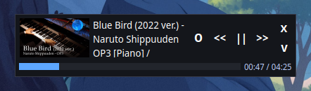
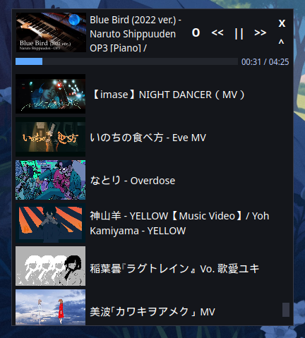
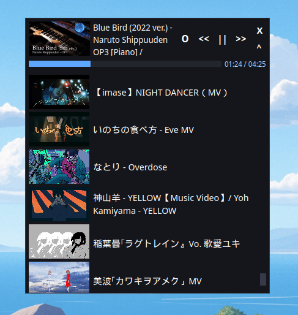

# Pmp3 - Compact minimalistic audio player
🎵 **MP3 Player in Python**  
A minimalist and user-friendly MP3 player built with **PyQt6** for the graphical interface, **Pygame** for audio playback, and **Mutagen** for reading audio file metadata.

🔧 **Technologies:**
- `PyQt6` — for building a cross-platform GUI  
- `Pygame` — for reliable audio playback  
- `Mutagen` — for extracting track titles and album covers




Run player
```
python main.py path/to/music_folder
```
